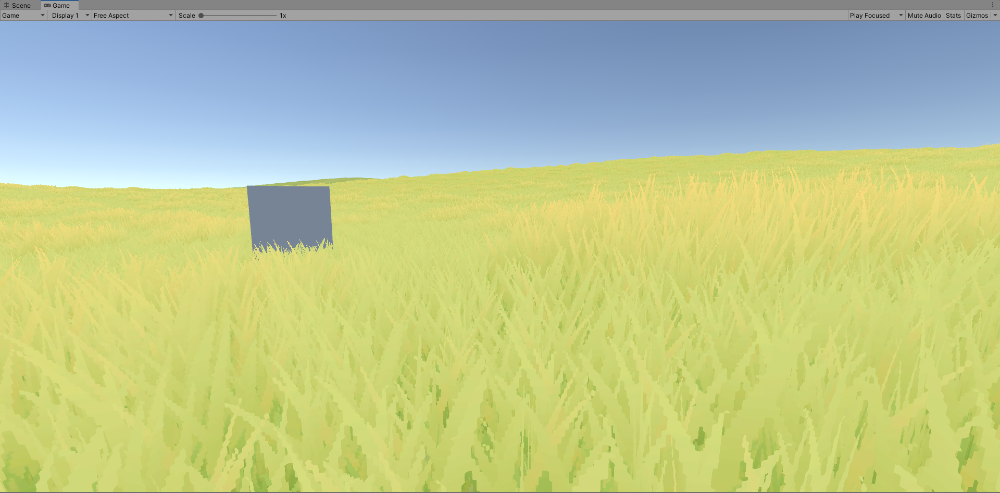
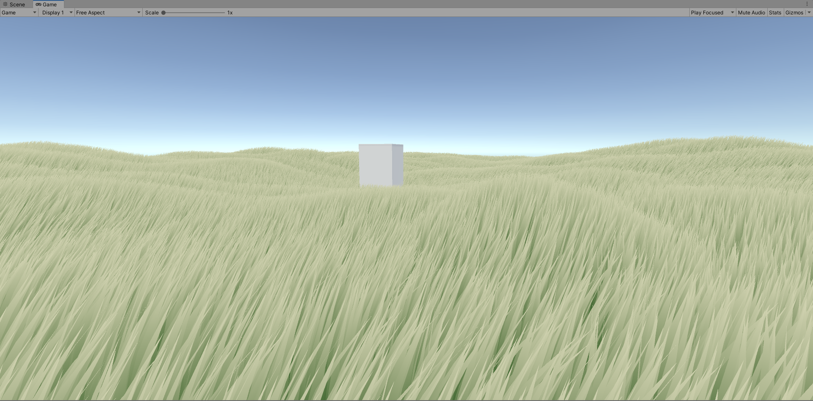
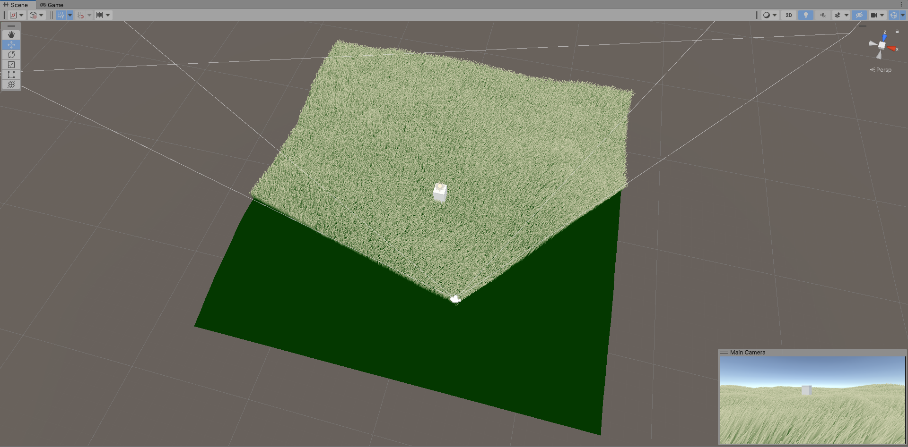
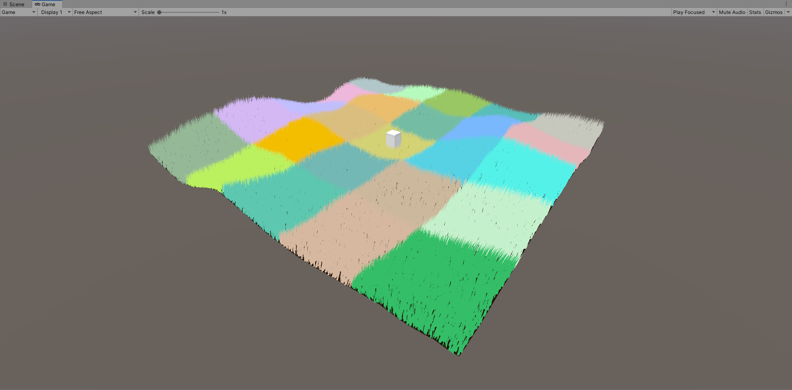
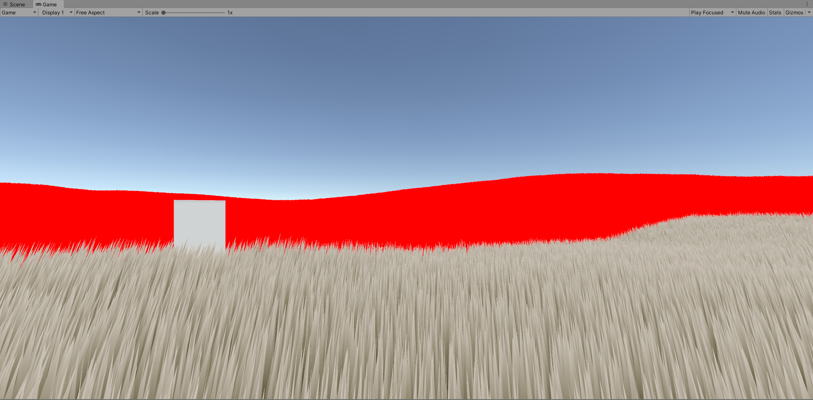
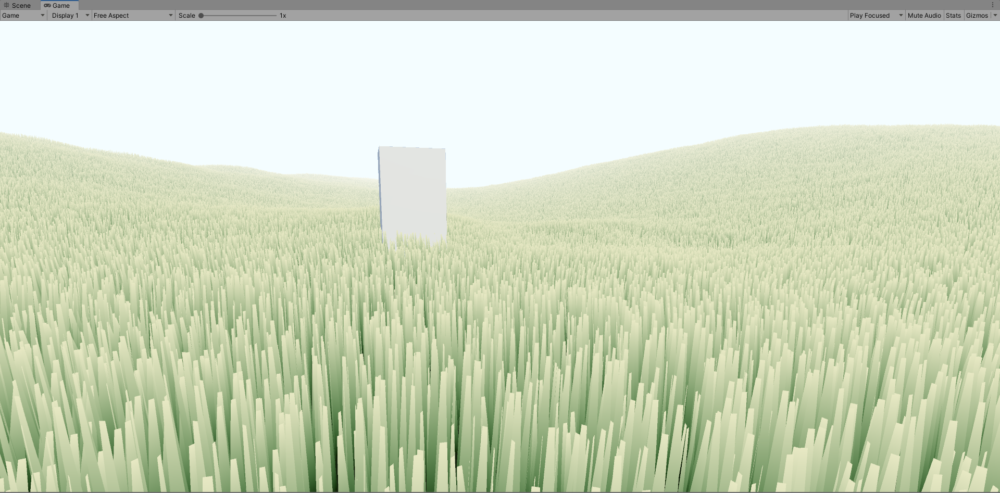

# Grass

by Garrett Gunnell

An exploration of grass rendering techniques.

DISCLAIMER: While this grass is highly performant and optimized, please don't attempt to use it yourself as it is tuned to my needs. Instead, reference it as much as you'd like. I apologize for the mess.

# Features

* GPU Instancing
* GPU Frustum Culling
* Chunked grass position buffers to cover any desired area
* Level of detail applied to distant chunks
* Scrolling noise texture to simulate wind
* Shaders for quad grass and individual grass blade 3d models
* Geometry Shader Grass

## Quad Grass

Implementation details [here](https://www.youtube.com/watch?v=Y0Ko0kvwfgA).

## 3D Model Grass

Implementation details [here](https://youtu.be/jw00MbIJcrk).

## GPU Frustum Culling

## Chunking

## Level Of Detail

## Geometry Shader Grass

(don't reference the code for this or use it)

